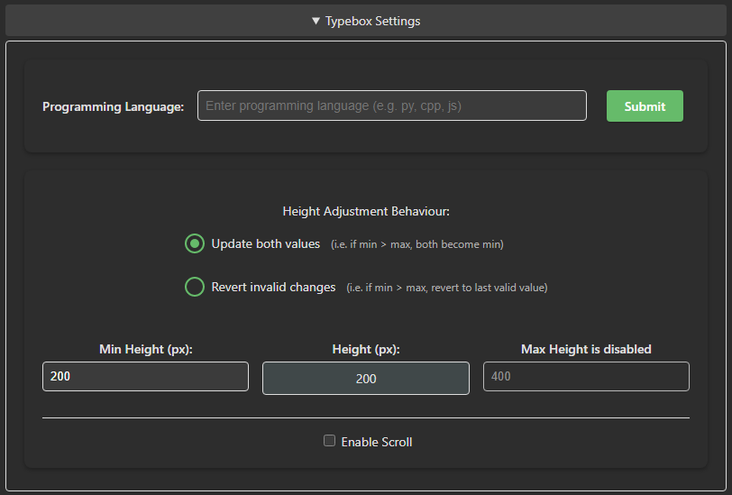
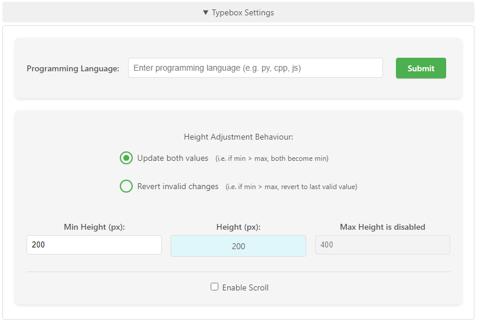

# Anki Typebox

[](https://ankiweb.net/shared/info/681236951)

An enhanced text input add-on for Anki that provides a multi-line input experience, particularly optimized for programming code review and technical content.




## Overview

Anki Typebox enhances Anki's built-in type-in-the-answer feature by providing a full-featured text area that supports:
- Multi-line text input with proper indentation preservation
- Programming language-specific formatting
- Customizable input area dimensions
- Code-friendly features (tab handling, symbol preservation)
- Syntax highlighting (coming soon)

## Why Use Anki?

Anki is a powerful spaced repetition software that helps you remember things efficiently. As explained in [Gwern's comprehensive article on spaced repetition](https://www.gwern.net/Spaced%20repetition), this method is particularly effective for long-term retention of information, making it ideal for:
- Programming concepts and syntax
- Technical documentation
- Complex problem-solving patterns
- Any content requiring detailed written responses

## Installation

1. Open Anki
2. Navigate to Tools → Add-ons → Get Add-ons...
3. Paste in the code: `681236951`
4. Restart Anki

## Features

### Core Functionality
- **Multi-line Input**: Type complex, formatted responses with preserved spacing and indentation
- **Programming Language Support**: Specialized handling for various programming languages
- **Customizable Interface**: Adjust input area size and behavior
- **Auto-focus**: Automatically focuses the input area when a card contains a typebox

### Settings
- Adjustable minimum and maximum height
- Scrolling behavior controls
- Programming language selection
- Height adjustment behavior options

## Usage

Add the following to your card templates where you want the typebox to appear:
```
[[typebox:FieldName]]
```

Where `FieldName` is the name of the field containing the correct answer.

## Contributing

This is a community-maintained fork of the original Anki Typebox add-on. Contributions are welcome! Please feel free to:
- Submit issues for bugs or feature requests
- Create pull requests with improvements
- Share your use cases and suggestions

## Development Status

This project is actively maintained by the community. The project was created by [robbielaldrich](https://github.com/robbielaldrich) who is no longer maintaining it.

<!-- ## License

[License Type] - Consider adding appropriate license information for your fork -->

## Acknowledgments

- Original author of Anki Typebox, [robbielaldrich](https://github.com/robbielaldrich)
- All contributors to this project

---

*Note: For support, please use the GitHub issues system rather than AnkiWeb comments.*